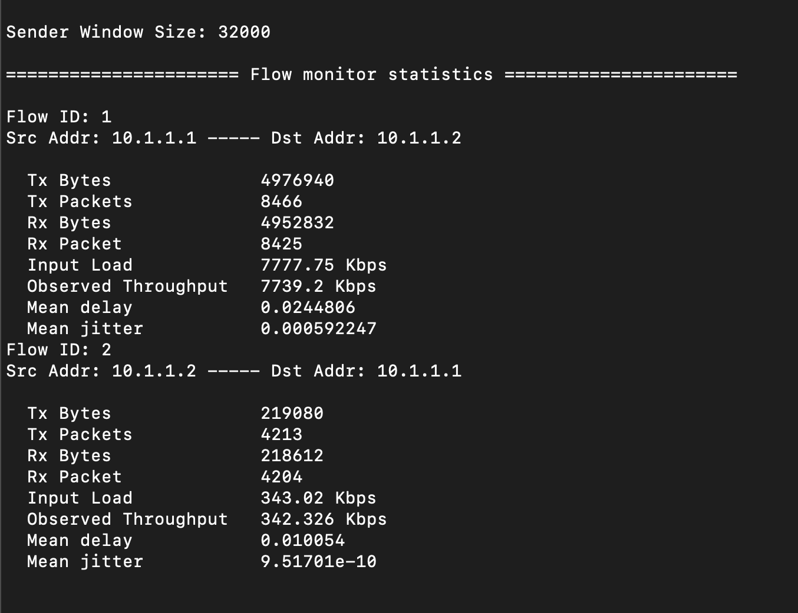

## Lab 4

### Sahasra Ranjan (190050102)

These experiments are done on:

- Ubuntu docker container on MacOS

#### Exercise 1

Warm-up task.

#### Exercise 2: FTP flow

Starting from the given values in the `lab4FTPonly.cc` file. I increased the window size by factors of 2, starting from 8000 bytes going up to 128000 bytes. Terminal log for the runs are attached [here](https://drive.google.com/drive/folders/1133U_KP0o6NK1vEQafl4urKuSdiL9TeM?usp=sharing).

1. For the given link data rate, the maximum observed throughput the ftp flow achieved was **~7740 Kbps**. After that it decreased to ~6500 Kbps then almost constant for further increase in the window size
2. Observed window size will be RTT*Throughput. 

$$
\text{RTT} = \Sigma\ \text{(mean delay)} = 0.0244806 + 0.010054 = 0.0345346 s\\
\text{Throughput} = 7739.2 \text{ Kbps}\\
\\
\text{Window Size } = \text{Throughput} * \text{RTT} /8 \\
= \frac{7739.2 * 1024 * 0.0345346}{8} \approx 34210 \text{ bytes}
$$

Calculated window size = **34210 bytes** which is close to 32000 bytes (actual window size)

This calculation is based on the experiment attached below: 

3. Minimum window size (experimentally) for the throughput mentioned above was **32000** bytes.
4. Maximum achieved throughput is lesser than the raw data of the link (8 Mpbs). For smaller value it is much less but for larger value it becomes constant and close to the raw data link. It never exceeds the Raw Data link rate
5. On changing the delay, changes in throughputs are observed. Detailed output is attached [here](). 
   - On doubling the delay, Tx bytes, Tx packets, Rx bytes, Rx packets, Input Load, Observed Throughputs decreased by a factor of 2.
   - Mean delay was proportional to the delay rate (for the delay rates tested)
   - Observed Data for the experiment are provided below (10.1.1.1 $\rightarrow$ 10.1.1.2, for the other side data is similar and is attached in the link above):

|   Parameters ↓ \ Delay ➝   |  5 ms   |  10 ms  |  20ms   |
| :------------------------: | :-----: | :-----: | :-----: |
| **Obs. Throughput** (Kbps) | 5710.77 | 3011.56 | 1550.6  |
|   **Input Load** (Kbps)    | 5715.9  | 3024.56 | 1557.25 |
|        **Tx Bytes**        | 3658056 | 1934040 | 995592  |
|       **Tx Packets**       |  6223   |  3291   |  1695   |
|        **Rx Bytes**        | 3654538 | 1926984 | 987360  |
|       **Rx Packets**       |  6217   |  3279   |  1681   |

#### Exercise 3: CBR flow

Starting from the given values in the `lab4CBRonly.cc` file. I started testing from CBRdatarate value 448Kbps to 28672Kbps, doubling the data rate for each test. 

1.  Observed throughput for 3 of the tests are provided below:

| CBR data flow rate | Observed Throughput |
| :----------------: | :-----------------: |
|      448 kbps      |    461.296 Kbps     |
|     3584 kbps      |    3684.46 Kbps     |
|     14336 Kbps     |    7768.12 Kbps     |

2. Maximum observed throughput this flow achieved was around **7800 kbps**.
3. These throughputs are less than the Raw data rate (i.e. 8 Mbps). Also for any CBR data rate, it will be less that the Raw data rate. For smaller values it might increase but will become constant after getting close to 7.5Mbps (< 8 Mbps)

