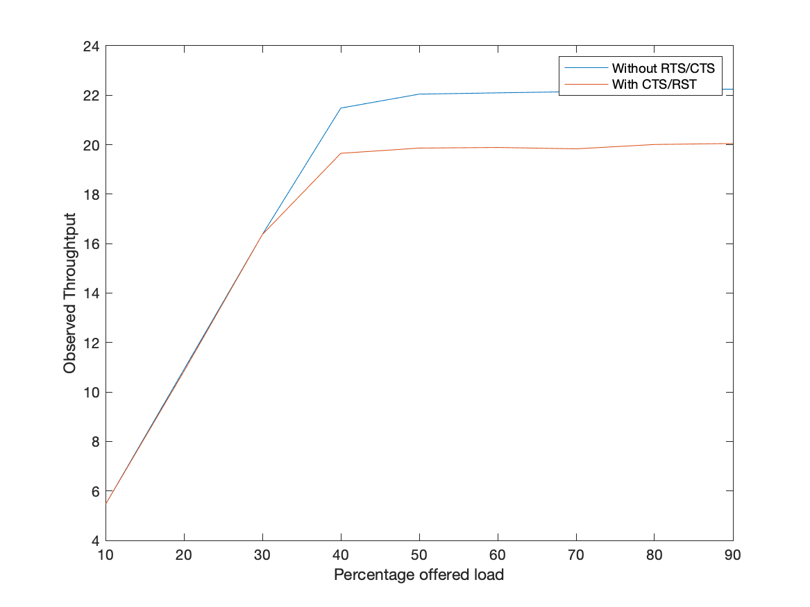
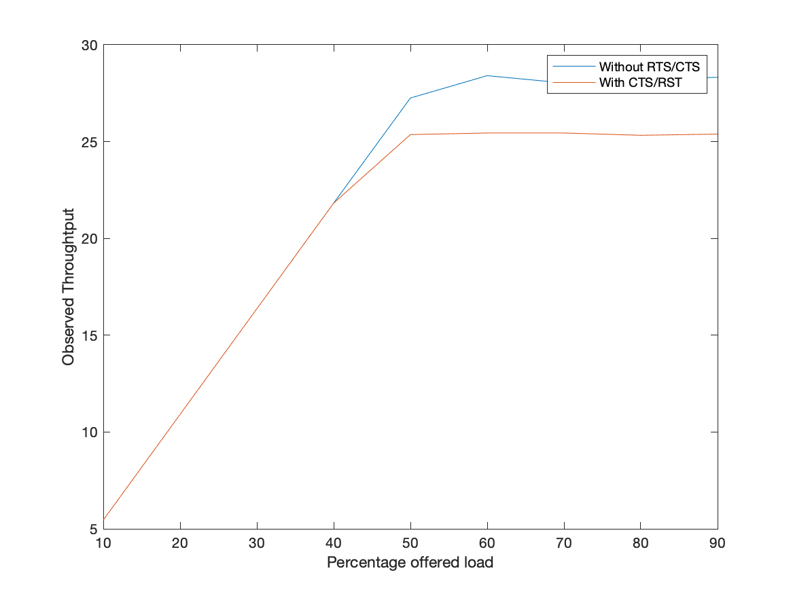
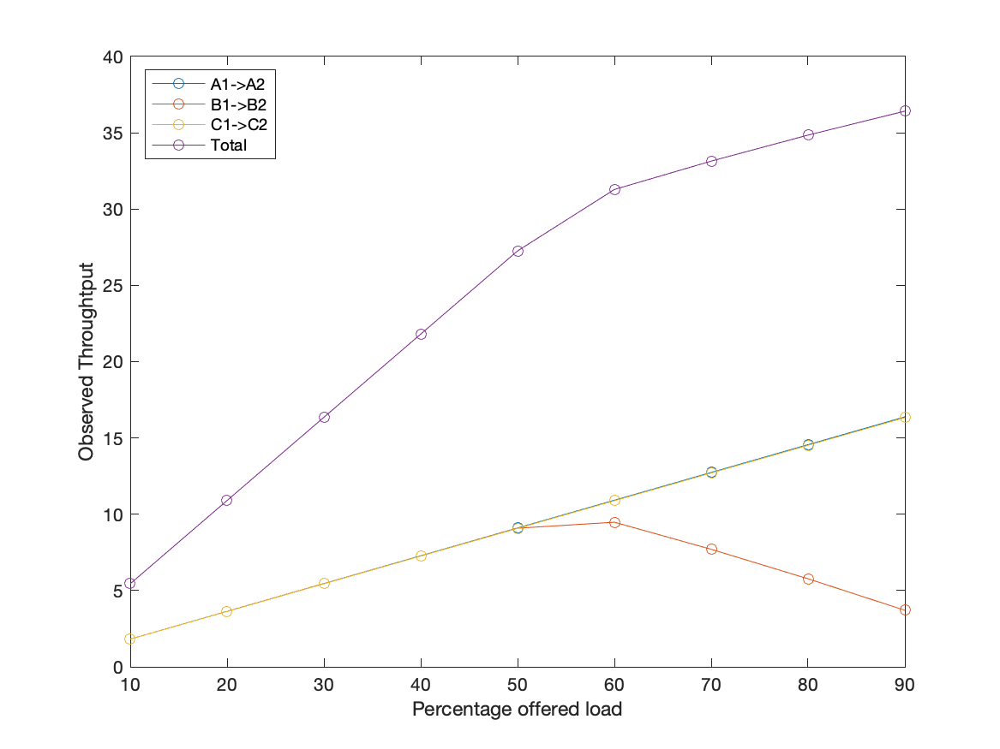
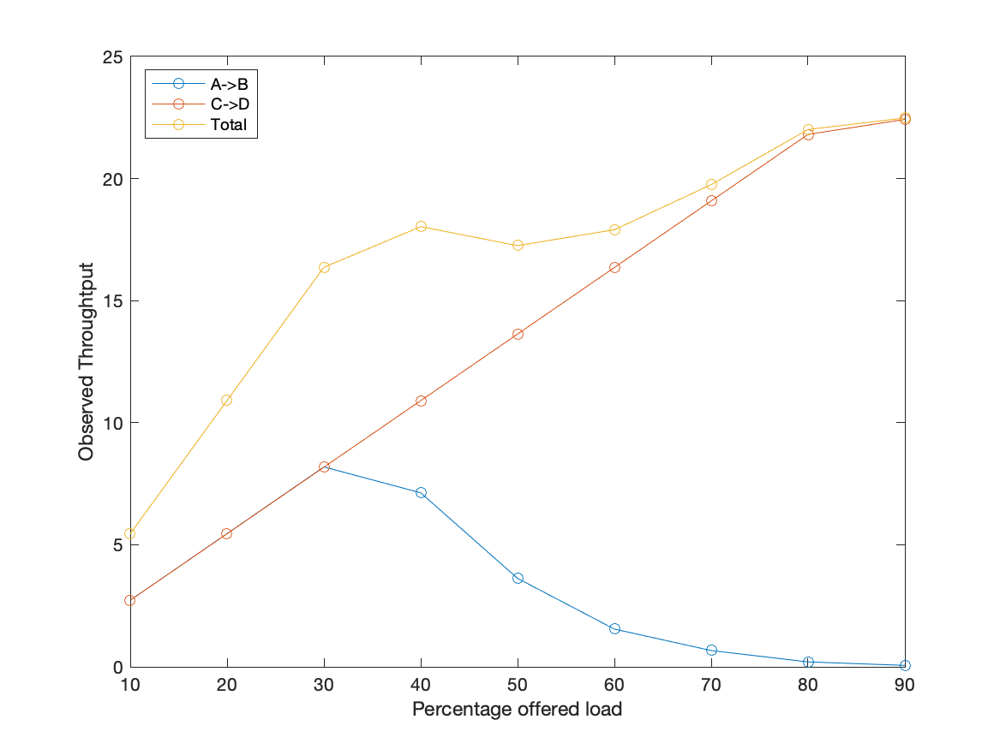

# Lab-5 Report
## Sahasra Ranjan (190050102)

#### 1
This is the standard hidden terminal problem, $A \to B \leftarrow C$. In this case RTS/CTS will improve the throughput since it is designed to avoid the collisions due to multiple hidden senders to a single source.

**a)** For the default parameters, the throughput values are:

|         Flow         | Throughput in Mbps | Throughput in Mbps (RTS/CTS) |
| :------------------: | :----------------: | :--------------------------: |
| Flow 1:  $n1 \to n0$ |      9.71408       |           10.1113            |
| Flow 2: $n2 \to n0$  |      9.37797       |            10.096            |
|        Total         |    **19.0921**     |         **20.2073**          |

**b)** Throughput values for varying data rate values:

| Percentage Load | Total Offered Load (Mbps) | Throughput | Throughput (RTS/CTS) |
| :-------------: | :-----------------------: | :--------: | :------------------: |
|      10 %       |            5.4            |  5.45414   |       5.45414        |
|      20 %       |           10.8            |  10.8344   |       10.9108        |
|      30 %       |           16.2            |  16.3675   |       16.3675        |
|      40 %       |           21.6            |  19.6522   |       21.4805        |
|      50 %       |           27.0            |  19.8636   |       22.0457        |
|      60 %       |           32.4            |   19.889   |       22.0967        |
|      70 %       |           37.8            |   19.883   |        22.145        |
|      80 %       |           43.2            |  20.0087   |        22.252        |
|      90 %       |           48.6            |  20.0495   |       22.2444        |

**c)** For single source, maximum throughput possible was **25.6182 Mbps** (for RTS/CTS disabled) and  **22.6288** for (RTS/CTS enabled). The reason for slower throughput for RTS/CTS enabled protocaol is the wait time and other time gap for RTS/CTS which takes more time as compared to the standard protocol.

| Percentage Load | Total Offered Load (Mbps) | Throughput | Throughput (RTS/CTS) |
| :-------------: | :-----------------------: | :--------: | :------------------: |
|      10 %       |            5.4            |  5.45924   |       5.45924        |
|      20 %       |           10.8            |   10.921   |        10.921        |
|      30 %       |           16.2            |  16.3803   |       16.3803        |
|      40 %       |           21.6            |   21.842   |        21.842        |
|      50 %       |           27.0            |  25.6156   |       22.6645        |
|      60 %       |           32.4            |  25.6156   |       22.6288        |
|      70 %       |           37.8            |  25.6182   |       22.6288        |
|      80 %       |           43.2            |  25.6182   |       22.6288        |
|      90 %       |           48.6            |  25.6182   |       22.6288        |

**d)** All the data are attached above, both with RTS/CTS and without RTS/CTS.

-----

#### 2 
In this case, all the three nodes can hear each other. In this case similar to the 1c problem, throughput for RTS/CTS enabled protocal will be less as compared to the standard protocol, reason being the same, wait time b/w each transfer.

**a)**

| Percentage Load | Total Offered Load (Mbps) | Throughput | Throughput (RTS/CTS) |
| :-------------: | :-----------------------: | :--------: | :------------------: |
|      10 %       |            5.4            |  5.45414   |       5.45414        |
|      20 %       |           10.8            |  10.9108   |       10.9108        |
|      30 %       |           16.2            |  16.3675   |       16.3675        |
|      40 %       |           21.6            |  21.8242   |       21.8217        |
|      50 %       |           27.0            |  27.2529   |       25.3636        |
|      60 %       |           32.4            |  28.4064   |        25.445        |
|      70 %       |           37.8            |  28.0295   |        25.445        |
|      80 %       |           43.2            |  28.2383   |       25.3254        |
|      90 %       |           48.6            |  28.3198   |        25.389        |

**b)** Throughput data with and without RTS/CTS are attached

-----

#### 3

**a)** For the default parameters, the throughput values are:

|    Flow     | Throughput in Mbps |
| :---------: | :----------------: |
| $A1 \to A2$ |      10.1088       |
| $B1 \to B2$ |       9.52565      |
| $C1 \to C2$ |      10.0807       |
|    Total    |     **29.7152**    |

**b)** For smaller values (< 60%) of total offered load, throughput is close to offered load. After $\approx$ 60%, throughput became constant with any further increase in the total offered load.

| Percentage Load | Offered Load (Mbps) | Throughput (CTS/RST) | $A1\to A2$ | $B1 \to B2$ | $C1 \to C2$ |
| :-------------: | :-----------------: | :------------------: | ---------- | ----------- | ----------- |
|      10 %       |         5.4         |       5.44651        | 1.81805    | 1.8155      | 1.81296     |
|      20 %       |        10.8         |       10.9006        | 3.63864    | 3.63355     | 3.62846     |
|      30 %       |        16.2         |       16.3548        | 5.45924    | 5.4516      | 5.44396     |
|      40 %       |        21.6         |       21.8064        | 7.27983    | 7.2671      | 7.25946     |
|      50 %       |        27.0         |       27.258         | 9.10043    | 9.08515     | 9.07242     |
|      60 %       |        32.4         |       31.2837        | 10.9185    | 9.47728     | 10.8879     |
|      70 %       |        37.8         |       33.145         | 12.7391    | 7.70251     | 12.7034     |
|      80 %       |        43.2         |       34.8485        | 14.5597    | 5.7698      | 14.5189     |
|      90 %       |        48.6         |       36.4195        | 16.3803    | 3.70485     | 16.3344     |

**c)** For small data rates (< 50%), throughput values are similar for all three flows. But for larger values, CBR flow rate for $B1 \to B2$ decreases and for other two flows it remains same. Reason for this is the interruption to the flow $B1 \to B2$ by both the other flows. Since Bs are in the middle in topology they are interrupted more as compared to flow $A1 \to A2$ and $C1 \to C2$. Also $T_a \approx T_c$, since both are symmetrically placed in the topology. It is not exactly same because of different start time (assumed because of machine/human error in practical experiments).
$$
T_a \approx T_c \geq T_b
$$

-----

#### 4

**a)** For the default parameters, the throughput values are:

|        Flow        | Throughput in Mbps |
| :----------------: | :----------------: |
| Flow 1: $A \to B$  |      8.24233       |
| Flow 2: $C \to D$  |      10.096        |
|       Total        |    **18.3383**     |

**b)** For smaller values (< 30%) of total offered load, throughput is close to offered load. After $\approx$ 60%, throughput became constant with any further increase in the total offered load.

| Percentage Load | Total Offered Load (Mbps) | Throughput (RTS/CTS) | $A \to B$ | $C \to D$ |
| :-------------: | :-----------------------: | :------------------: | --------- | --------- |
|      10 %       |            5.4            |       5.45414        | 2.72962   | 2.72453   |
|      20 %       |           10.8            |       10.9108        | 5.45924   | 5.4516    |
|      30 %       |           16.2            |       16.3675        | 8.18885   | 8.17867   |
|      40 %       |           21.6            |       18.0302        | 7.12705   | 10.9032   |
|      50 %       |           27.0            |       17.2536        | 3.62336   | 13.6303   |
|      60 %       |           32.4            |       17.9029        | 1.5456    | 16.3573   |
|      70 %       |           37.8            |       19.7515        | 0.667127  | 19.0844   |
|      80 %       |           43.2            |       22.0101        | 0.201157  | 21.8089   |
|      90 %       |           48.6            |       22.4812        | 0.0585646 | 22.4226   |

**c)** For small values of data rate, throughput is almost same for both the flows but for larger data rates, throughput value of flow $A \to B$ decreased rapidly. Reason behind this is the RTS/CTS protocol. For the flow $A \to B$, $A$ will send RTS which only $B$ can hear and in response $B$ will send CTS which both $A$ and $C$ can hear. This will cause $C$ to stop the flow. But for the flow $C \to D$ , $C$ will send RTS which both $D$ and $B$ can hear. And so $B$ will stop sending it's CTS to $A$.

So the interrupting signals are $C's $ RTS and DATA for flow $A \to B$ and $B's$ CTS for flow $C \to D$. Clearly $length(DATA + RTS) \gg length(CTS)$, so the flow $A \to B$ will be more interrupted.
$$
T_c \geq T_a
$$

-----

